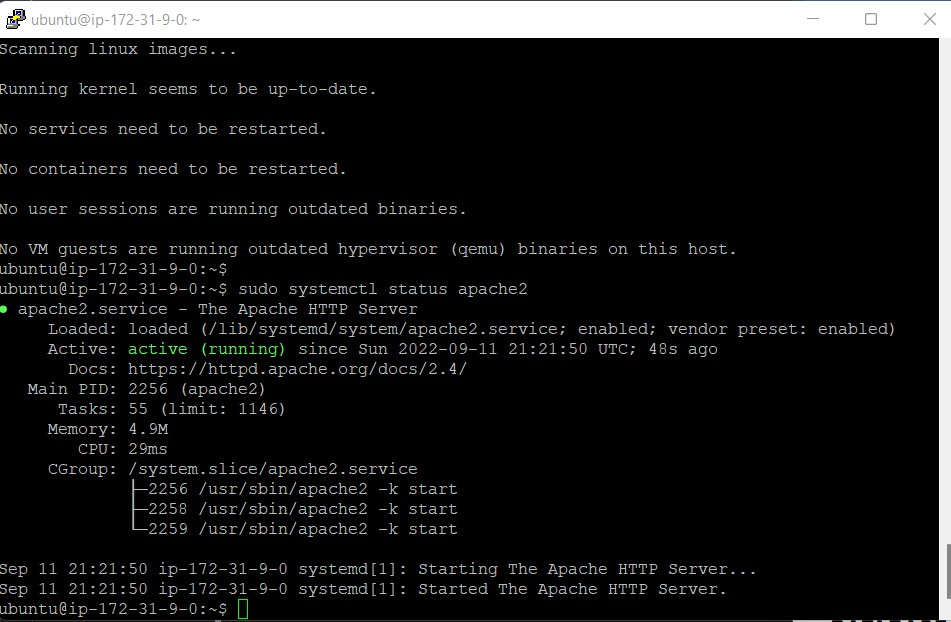
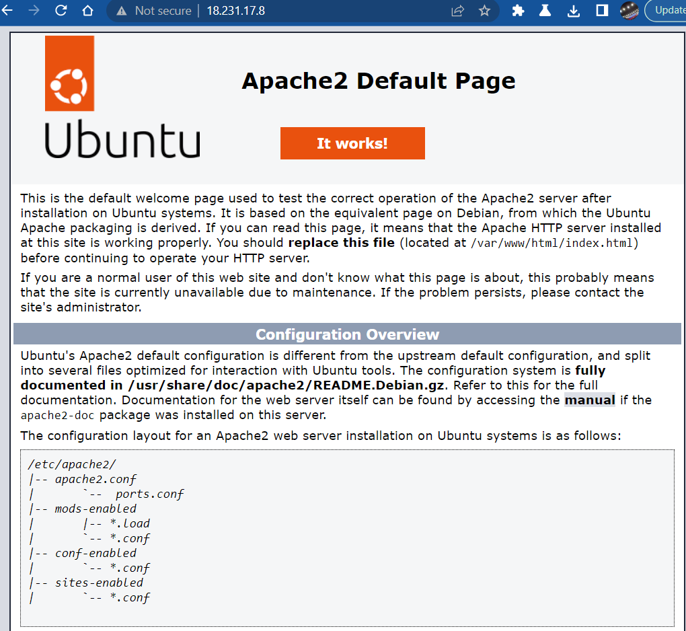
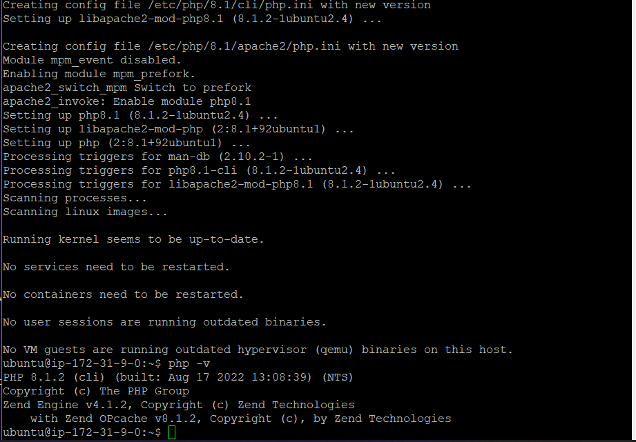
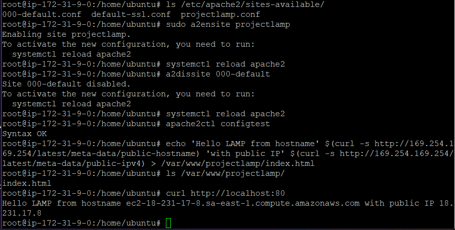
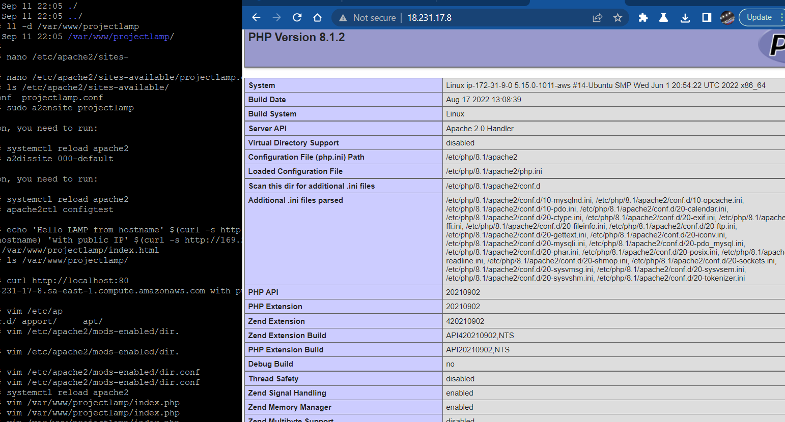

<<<<<<< HEAD
# Project 1

## Prerequisites - Connected to EC2 instance

1. I spun an EC2 instance on AWS and installed Ubuntu Linux on it
1. downloaded and installed **Putty** on my Windows computer and connected via **SSH** to the EC2 instance.
2. 

## Installed Apache and Updated the firewall
1. Installed Apache using Ubuntu's package manager 'apt'
2. added a rule to EC2 to open inbound connection through port 80
- 
3. verified that apache2 was running as a service on Ubuntu as you can see from a screenshot from my environment below.

4. tested apache's http server requests by entering my server's public IP address into my browser and got the following result in return:

## Installed MySQL
1. installed MySQL using the ***apt*** install command
2. confirmed successful install by using the **mysl** command as captured in the screenshot below
 

## Installed PHP
- installed all 3 packages by using the ***apt install php libapache2-mod-php php-mysql*** command
- confirmed the PHP version installed as shown below
- 

## Created a virtual host for my website using Apache
1. created an index.html file and used the ***echo*** command to print same on screen
 see the result of the **echo** below:
- 

## Enabled PHP on the website
- see the PHP page below

=======
# LAMP STACK IMPLEMENTATION

## Prerequisites - Connected to EC2 instance

1. I spun an EC2 instance on AWS and installed Ubuntu Linux on it
1. downloaded and installed **Putty** on my Windows computer and connected via **SSH** to the EC2 instance.
2. 

## Installed Apache and Updated the firewall
1. Installed Apache using Ubuntu's package manager 'apt'
2. added a rule to EC2 to open inbound connection through port 80
- 
3. verified that apache2 was running as a service on Ubuntu as you can see from a screenshot from my environment below.

4. tested apache's http server requests by entering my server's public IP address into my browser and got the following result in return:

## Installed MySQL
1. installed MySQL using the ***apt*** install command
2. confirmed successful install by using the **mysl** command as captured in the screenshot below
 

## Installed PHP
- installed all 3 packages by using the ***apt install php libapache2-mod-php php-mysql*** command
- confirmed the PHP version installed as shown below
- 

## Created a virtual host for my website using Apache
1. created an index.html file and used the ***echo*** command to print same on screen
 see the result of the **echo** below:
- 

## Enabled PHP on the website
- see the PHP page below

>>>>>>> 7fa9f6db460c44870edc4381cc7d306c427ed51d
