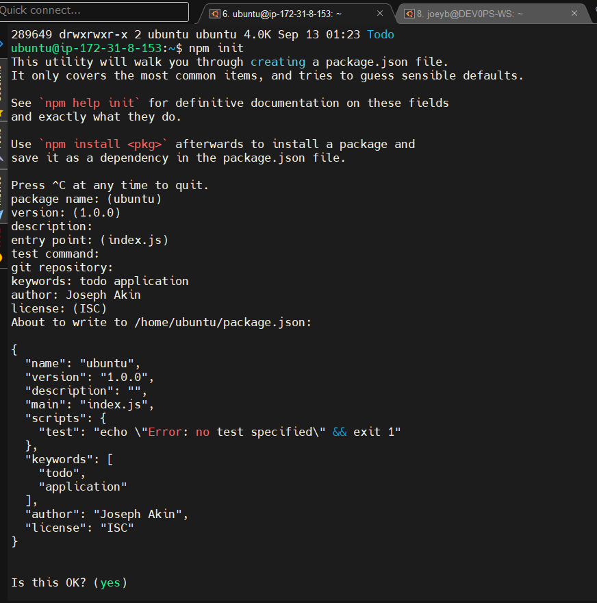
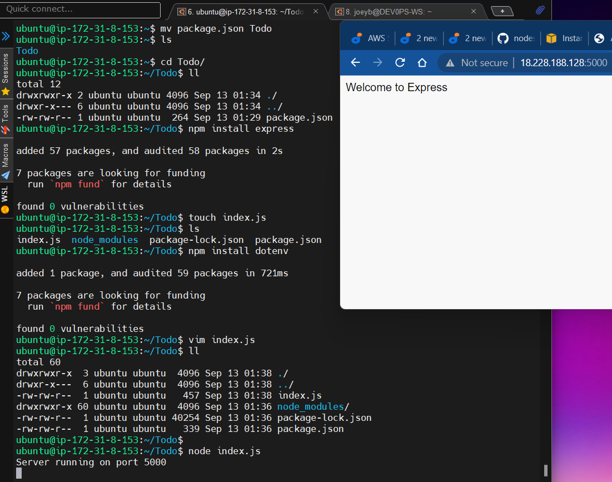
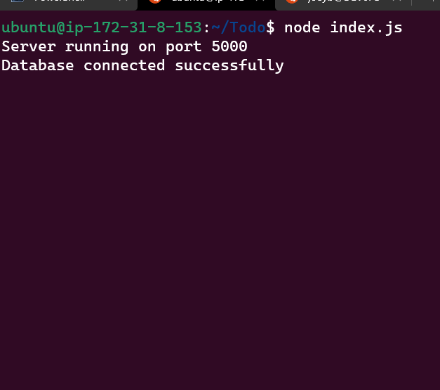
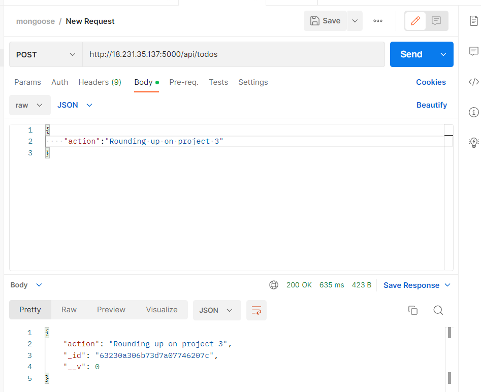
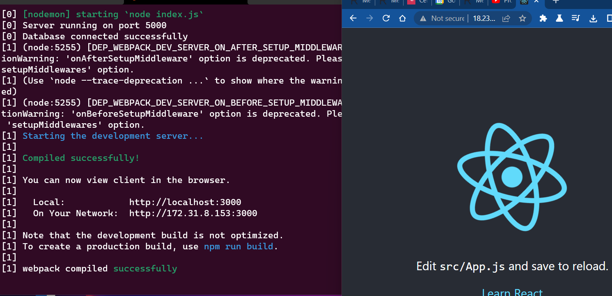
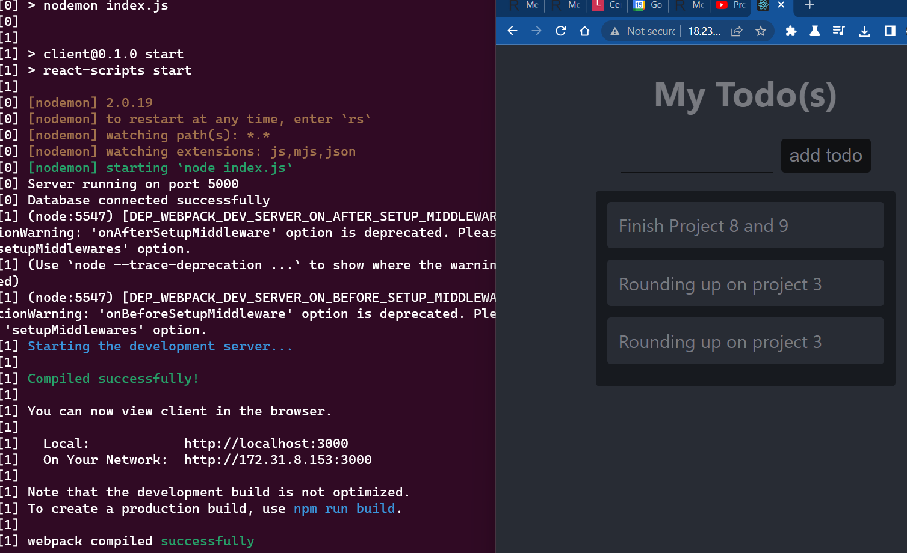

# Project 3: To-do application on MERN web stack

## Connected to EC2 instance via MobaXterm

Spun a new EC2 instance, downloaded and installed MobaXterm on my PC and connected to the instance via SSH on MobaXterm.

## Installed Node.js on the server

Installed Node.js by using the command - ***sudo apt-get install -y nodejs***

verified the node installation with ***node -v*** and ***npm -v***

- 

created a new directory called **Todo**, initialized the project using **npm init** which then created a new file called **package.json** as shown below

## Installed Express JS
- installed Express JS by using the **npm install express** command

- created the **index.js** file

- installed the dotenv module by using the command **npm install dotenv**

- edited the index.js file and specified port 5000 to be used. 

- see results from running the **node index.js** command, and on running the **http://<PublicIP-or-PublicDNS>:5000** from the browser, gives below:

- 

created a directory called **routes**

created a file called **api.js**

installed mongoose by using the **npm install mongoose** command 

created a new directory called **models**

created the file **todo.js** inside the models folder

## MongoDB

Created a MongoDB account and connected to the MongoDB database as shown below:
- 

## Tested Backend Code without Frontend using RESTful API

Downloaded and installed Postman for this purpose. 

Created the POST and GET operations using Postman 

POST
- 

## Frontend creation

### Created a user interface for a Web client (browser) to interact with the application via API as follows:

ran the **npx create-react-app client** command in the **Todo** directory to create a new folder called **client**. 

## Running the React App

installed **concurrently** which is used to run more than one command simultaneously from the same terminal window by using the following command: ***npm install concurrently --save-dev***

installed **nodemon** which is used to run and monitor the server. this was installed by using the command ***npm install nodemon --save-dev***

**Concurrently and Nodemon**

edited the **package.json** file in the Todo folder

added the key value pair in the **package.json** file "proxy": "http://localhost:5000" so that it will be possible to access the application directly from the browser by simply calling the server url as shown below: 

- 

## Created React components

- created a new folder called components

- in the components folder, created the following files: Input.js, ListTodo.js and Todo.js

- edited the Input.js file

- installed **Axios**, a Promise based HTTP client for the browser and node.js

- edited the ListTodo.js file

- edited the Todo.js file

- edited the App.js file

- finally, edited the index.css file

- and the result gotten is as shown below:
- 
