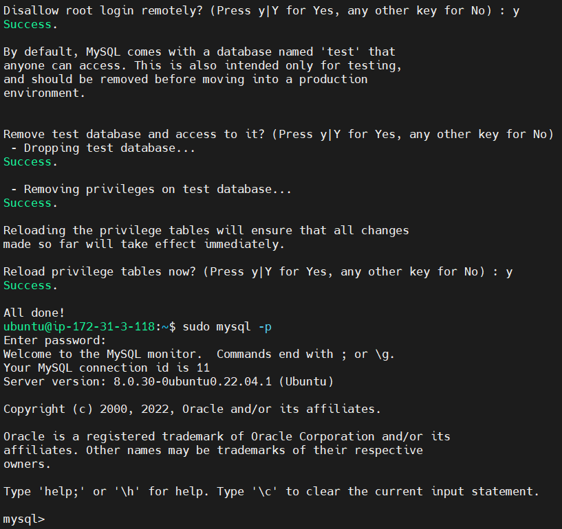
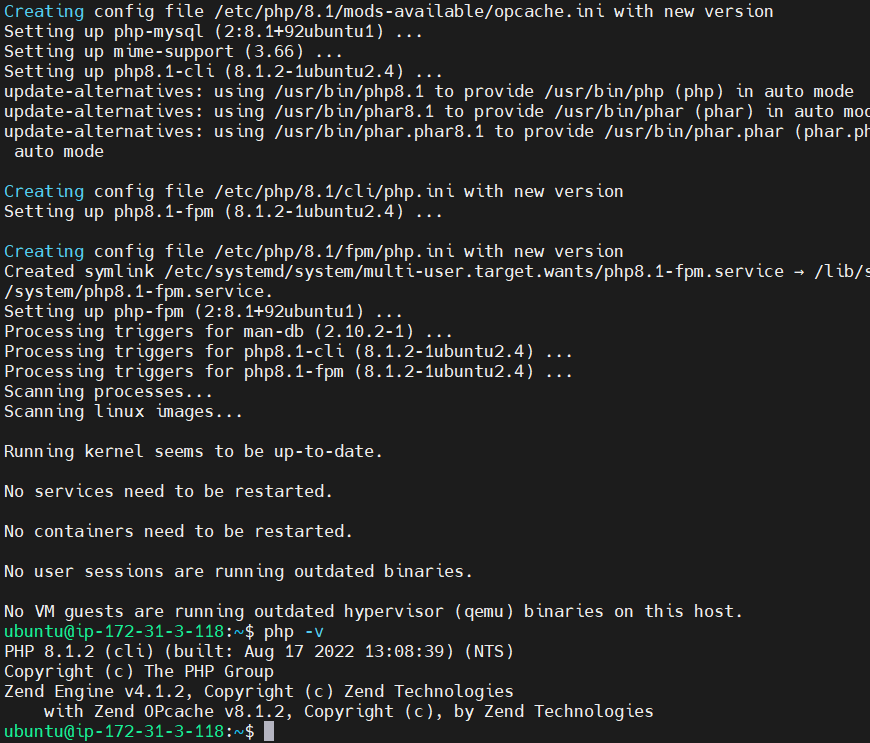
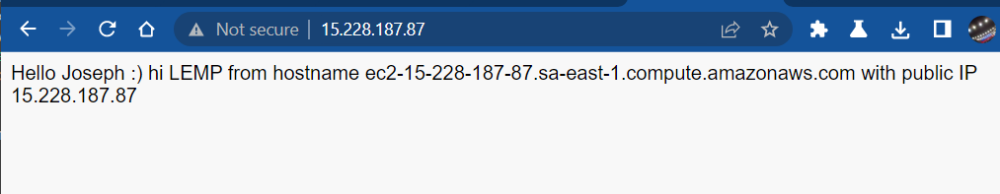
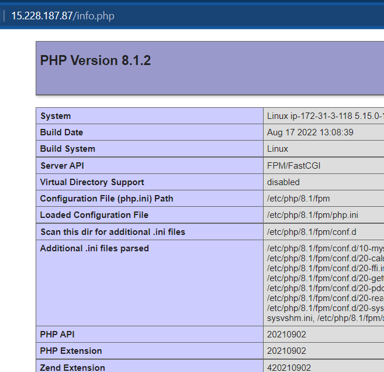
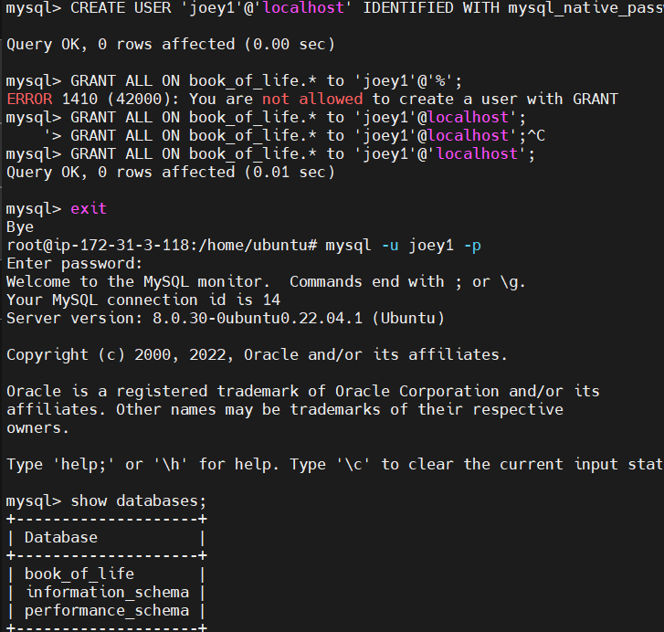
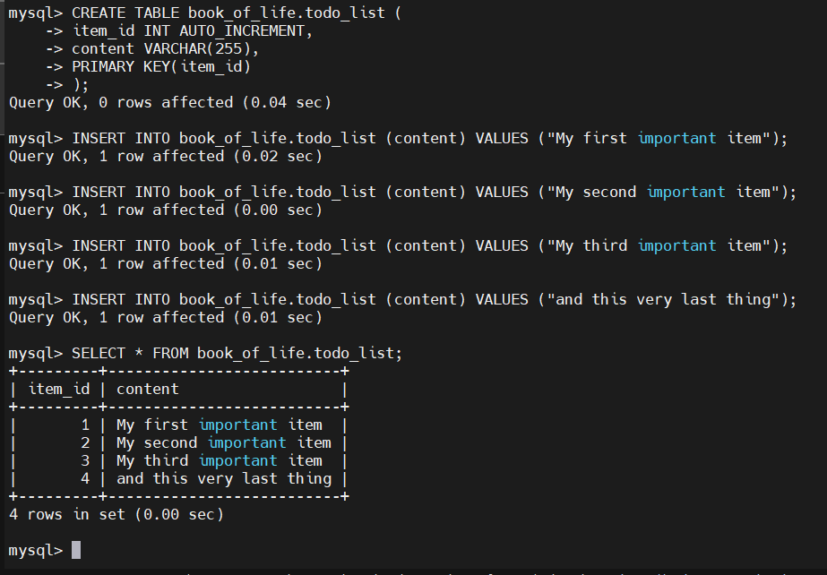
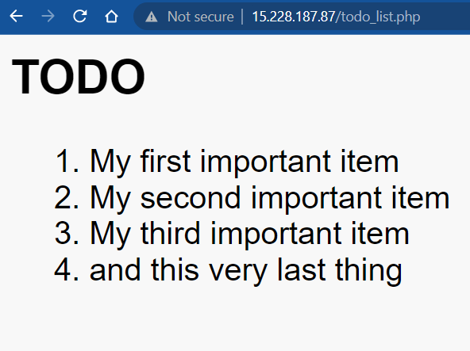

# LEMP STACK IMPLEMENTATION
Joseph Akinrinmade's Freestyle Project

## Connected to EC2 instance via GitBash

I spun a new EC2 instance, downloaded and installed Mobaxterm with my WSL2. Then I connect to the same ubuntu server via SSH

## Installed the Nginx web server

I installed the Nginx web server by using the following command:
> sudo apt update 
> sudo apt install nginx
- 
I also added a rule to the EC2 configuration to open inbound connection through port 80 and then, was now able to access the web server.

## Installed MySQL as confirmed below
- 

## Installed PHP by using the command - sudo apt install php-fpm php-mysql
- 

## Configured Nginx to use the PHP processor
First, I created a directory for the new Project. i.e. ProjectlEMP with this command
 > $sudo mkdir /var/www/projectlEMP

Next, I assigned ownership of the directory with the $ USER environment variable by entering the following command

 ==$sudo chown -R $USER:$USER /var/www/projectlEMP==

- On using the echo command, it resulted in the following:
- 

- 

### Tested out PHP with Nginx
- 

## created and retrived data from a new database I just created
- 

## Created a todo_list on PHP

- 

## Tested the connection and all worked as expected
- 
